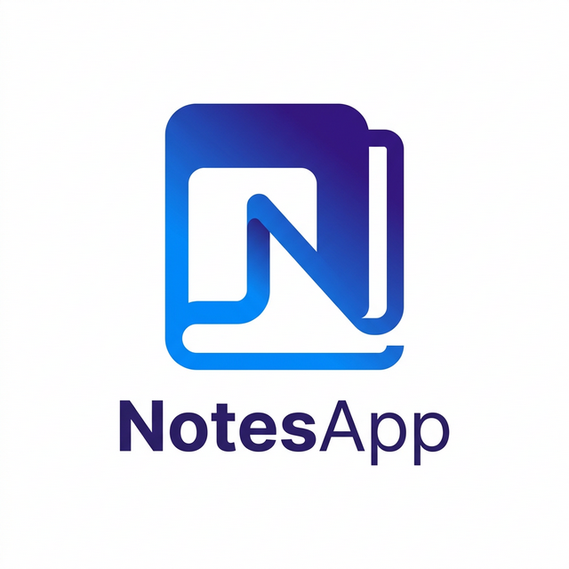
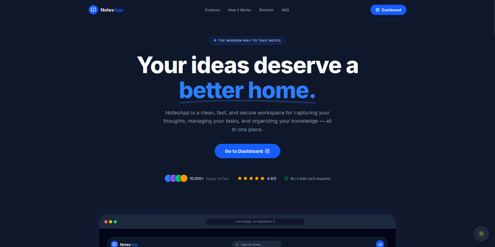

#  NotesApp — Premium Full-Stack Note-Taking Solution



NotesApp is a professional, high-performance note-taking workspace designed for modern productivity. It features a stunning glassmorphic UI, lightning-fast search, and a robust MERN (MongoDB, Express, React, Node.js) architecture.

---

## ✨ Features

### 🗒️ Smart Note Management
- **PIN & Organize**: Keep your most important thoughts at the top.
- **Color Coding**: Categorize notes using a vibrant, premium color palette.
- **Priority Labels**: Set Low, Medium, or High priority to manage your workflow.
- **Instant Search**: Search across thousands of notes in milliseconds using MongoDB Text Indexes.

### 🎨 Premium UI/UX
- **Dual Mode**: Seamless transition between a sleek Light Mode and a deep, eye-pleasing Dark Mode.
- **Glassmorphism**: Modern UI aesthetics with blurred backdrops and subtle borders.
- **Fully Responsive**: Pixel-perfect experience on mobile, tablet, and desktop.
- **Smooth Animations**: Powered by `framer-motion` for a fluid, high-end feel.

### 🛡️ Secure & Scalable
- **JWT Authentication**: Secure user sessions with JSON Web Tokens.
- **Profile Customization**: Upload and change profile images directly from the dashboard (powered by `multer`).
- **Performance Optimized**: 
  - Zero-lag mobile menu interactions.
  - Slashed bundle size (removed `moment`).
  - Strategic database indexing for extreme scalability.

---

## 🛠️ Tech Stack

### Frontend
- **Framework**: [React 19](https://reactjs.org/) (Vite)
- **Styling**: [Tailwind CSS 4](https://tailwindcss.com/)
- **Animations**: [Framer Motion](https://www.framer.com/motion/)
- **Icons**: [Lucide React](https://lucide.dev/)
- **Networking**: [Axios](https://axios-http.com/)

### Backend
- **Server**: [Node.js](https://nodejs.org/) & [Express.js](https://expressjs.com/)
- **Database**: [MongoDB](https://www.mongodb.com/) (Mongoose)
- **File Handling**: [Multer](https://github.com/expressjs/multer)
- **Security**: [Bcrypt.js](https://github.com/dcodeIO/bcrypt.js) & JWT

---

## 📦 Getting Started

### Prerequisites
- Node.js (v18+)
- MongoDB (Local or Atlas)

### 1. Installation
```bash
git clone https://github.com/shoriful-dev/Notes-App.git
cd Notes-App
```

### 2. Configure Backend
```bash
cd backend
npm install
```
Create a `.env` file:
```env
PORT=5000
MONGODB_URI=your_mongodb_connection_string
ACCESS_TOKEN_SECRET=your_secret_key
```
Start server:
```bash
npm run dev
```

### 3. Configure Frontend
```bash
cd ../frontend
npm install
npm run dev
```

---

## 📱 Mobile Experience
The application is built with a **Mobile-First** philosophy. Features like the sliding drawer menu, compact status indicators, and touch-optimized buttons ensure a great experience on the go.

---

## 🤝 Connect with Me
Built with ❤️ by **shoriful-dev**

[](https://github.com/shoriful-dev)
[](https://x.com/shoriful_dev)

---
*License: ISC*
